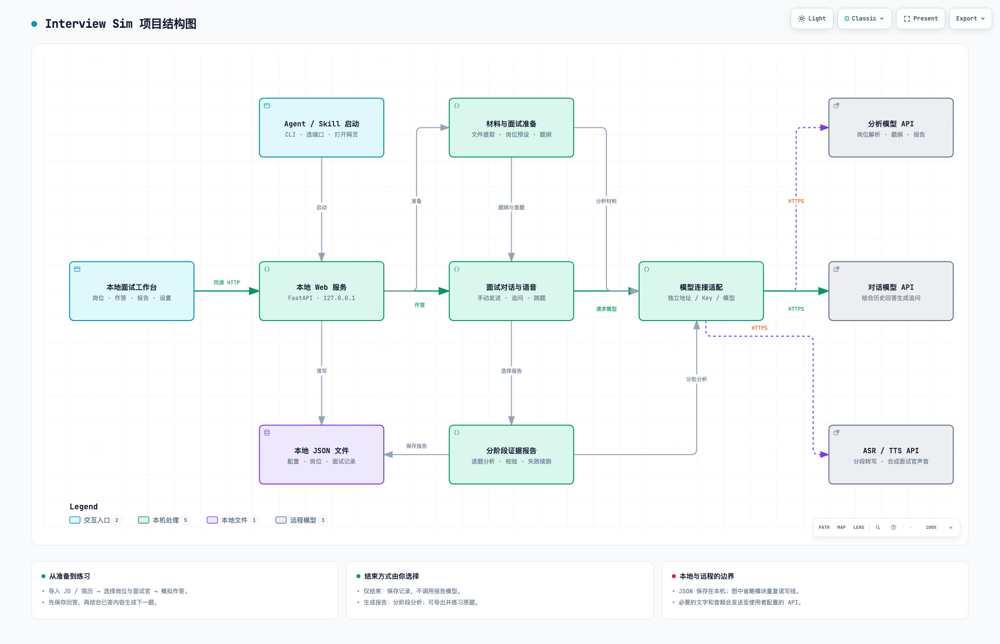

# Interview Sim · 本地 AI 面试工作台

用岗位 JD 和真实经历练习面试，把每条反馈追溯到自己的回答。

**Skill / Agent 启动 · 本地网页操作 · 文字与语音作答 · 四类模型独立配置**

[快速开始](docs/QUICKSTART.md) · [模型配置](docs/CONFIGURATION.md) · [操作指南](docs/USER_GUIDE.md) · [常见问题](docs/FAQ.md) · [提交问题](https://github.com/miaomiao636/interview-sim/issues)

> **公开测试版 v1.5.0-beta.1**：包含完整应用与通用 Skill，不是独立桌面安装包或托管网站。提供 Windows/macOS/Linux 安装流程及自动测试矩阵；各 Agent 与真实音频设备仍需独立验收，见 [兼容性](docs/COMPATIBILITY.md)。需自备模型 API，不承诺招聘结果。

**主分支源码已包含岗位准备与专家协作更新**：岗位双入口、简历内容建议与折叠查看、简历版本与逐项改写、纯实战、独立评分和面后素材确认。请克隆或下载 `main` 获取这些功能，旧的 `v1.5.0-beta.1` Release 不包含本次更新。使用说明见 [岗位准备](docs/PREPARATION.md) 与 [评分规则](docs/SCORING.md)。下方视频及 Archify 图展示旧版本的基础流程，新模块以使用文档和源码为准。

**2026-09-23 主分支修复**：增加重复题检查、跳题与题纲的统一进度、追问次数限制，以及系统重复跳题的评分排除；保留语音识别原文、手动结束与确认发送，不做自动润色。页面资源增加缓存更新措施。包版本暂保持 `1.5.0`，请以 `main` 的提交记录区分本次更新与旧版本，详见 [更新记录](CHANGELOG.md)。

## 演示视频

[▶ 查看 / 下载 89 秒操作演示（MP4）](https://github.com/miaomiao636/interview-sim/releases/download/v1.4.0-beta.2/interview-sim-demo.mp4)

视频展示岗位材料导入、AI 解析、面试配置与模拟作答。为避免公开本机信息，已裁去浏览器标签栏和 Dock，并对文件选择窗口做模糊处理。

## 项目结构图

[](https://miaomiao636.github.io/interview-sim/architecture/interview-sim.html)

[**点击打开交互结构图 ↗**](https://miaomiao636.github.io/interview-sim/architecture/interview-sim.html) · [可编辑 Archify 源文件](docs/architecture/interview-sim.architecture.json) · [SVG 导出图](docs/architecture/interview-sim.svg)

交互版支持缩放、节点搜索、关联高亮、深浅主题、演示模式与图片导出，由 [Archify](https://github.com/yuppiez99999/archify-) Skill 生成。README 显示预览图，点击图片或上方链接即可操作。也可下载 [HTML](docs/architecture/interview-sim.html) 后在本地浏览器打开。详见 [模块与数据流说明](docs/ARCHITECTURE.md)。

## 可以做什么

| 能力 | 实际行为 |
|---|---|
| 多岗位预设 | 独立保存公司、JD、简历与训练目标；导入后可人工修改 |
| 岗位准备 | 可选的简历诊断、岗位要求分析、真实经历提纲；逐项确认改写并保存版本 |
| 面试配置 | 选择角色、难度与声音，本次选择不覆盖岗位预设 |
| 自适应提问 | 结合公司材料与已保存回答追问；不自动联网核实公司信息 |
| 文件导入 | TXT、MD、DOCX、文本型 PDF、PNG/JPG/WEBP，本地提取文字 |
| 手动语音作答 | 约每 4 秒分段转写；停顿不结束，停止后编辑并确认发送 |
| 跳题与结束 | 跳题标记未回答；结束时可仅保存，或生成报告 |
| 证据报告 | 简历诊断、首次面试、重答成绩分别展示；引用先校验，失败复用已完成阶段 |
| 专项重答 | 面后只练原题一次，不自动追加普通问题；首次与重答成绩按同题对比 |
| 素材闭环 | 从已结束面试原答提取待确认素材；确认后才供下一次准备使用 |
| 导出 | Markdown、JSON、浏览器打印 / PDF |

## 快速开始

推荐 Python 3.12 和桌面 Chrome / Edge，最低 Python 3.11。旧 Python 3.9/3.10 环境需重建。正常使用不需要 Node.js，也无需构建前端。

macOS / Linux：

```bash
git clone https://github.com/miaomiao636/interview-sim.git
cd interview-sim
python3.12 -m venv .venv
source .venv/bin/activate
python -m pip install --upgrade pip
python -m pip install --require-hashes --only-binary=:all: -r requirements.txt
python -m pip install --no-deps -e .
python scripts/install_skill.py
interview-sim web
```

Windows PowerShell（获取完整项目并进入目录后）：

```powershell
py -3.12 -m venv .venv
.\.venv\Scripts\python.exe -m pip install --upgrade pip
.\.venv\Scripts\python.exe -m pip install --require-hashes --only-binary=:all: -r requirements.txt
.\.venv\Scripts\python.exe -m pip install --no-deps -e .
.\.venv\Scripts\python.exe scripts/install_skill.py
.\.venv\Scripts\interview-sim.exe web
```

无需管理员权限或更改 PowerShell 执行策略。Windows 默认复制注册 Skill；其他 Agent 的目录可用 `--dest` 指定，详见 [快速开始](docs/QUICKSTART.md)。

访问终端打印的 `INTERVIEW_SIM_URL`，通常为 `http://127.0.0.1:8800`；端口占用时自动选择后续端口。保持服务进程运行，不要双击 HTML 文件。

在“系统设置”填写目标岗位和模型连接，再创建岗位开始面试。**API Key 只在本地网页输入，不要发给 Agent 或提交 GitHub。**

安装 Skill 后，可以对支持本地 Skill 和命令执行的 Agent 说：

> 帮我启动 interview-sim 面试工作台；如果尚未配置，引导我在本地网页完成设置。

Skill 是完整应用的启动入口，不能只下载 `SKILL.md`。安装、ZIP 下载、虚拟环境和重新启动详见 [快速开始](docs/QUICKSTART.md)。

## 模型配置

网页支持对话、分析、ASR、TTS 分别设置地址和 Key，并分别填写模型名，也可继承同一连接。

- 对话 / 分析：OpenAI-compatible Chat Completions；分析接口还需支持 JSON 对象输出。
- 语音：MiMo 或标准 OpenAI Audio；厂商私有协议不能只改模型名兼容。
- 不使用语音时可文字作答并关闭自动朗读，对话与分析连接仍需配置。

字段、连接示例、音色与采样率要求见 [配置指南](docs/CONFIGURATION.md)。内置模型名只是默认值，不代表账号一定有调用权限。

## 运行与隐私边界

- 服务仅监听 `127.0.0.1`，不面向公网或局域网部署。
- 配置、岗位与面试记录保存在使用者自己的 `~/.interview-sim/`，与源码分离。
- 原始上传文件不长期保存；提取出的 JD、简历与回答会保存在本地记录。
- **本地网页不等于离线 AI**：使用 AI 识别、面试、语音或报告时，必要材料会发给对应模型服务。
- 设置接口不会返回 Key 明文；仍需保护本机配置、电脑与备份。
- 录音片段和未提交草稿仅在页面内存中，刷新或关闭前请先处理。

本仓库只提供源码与虚构示例，不附带真实用户资料。见 [隐私与安全](SECURITY.md)。

## 已知限制

1. 下一题失败后，已提交回答保留，可明确重试出题；生成中可刷新状态，不重发回答。服务关闭后不会自动重跑计费任务，需自行确认恢复。
2. 语音为约 4 秒分段 ASR，不是逐字实时识别；网络和提供商影响延迟，音质需在自己的设备上试听。
3. 扫描 PDF 暂不支持逐页 OCR，可改传图片；非 macOS 图片识别需 Tesseract 与中文语言包。
4. 未验证所有提供商、浏览器、操作系统与 Agent，不宣称通用兼容。
5. 报告时间仅供参考。分数不代表真实招聘评价，简历改写需核实，不能添加不存在的经历。
6. 岗位要求展示的是材料覆盖情况；当前不自动猜测某次回答证明了哪项要求。只支持一个服务进程写同一数据目录，不支持并发多进程部署。

## 文档导航

| 文档 | 内容 |
|---|---|
| [快速开始](docs/QUICKSTART.md) | 获取完整项目、安装 Skill、启动和停止 |
| [配置指南](docs/CONFIGURATION.md) | 四类模型、Key、协议与个人数据 |
| [操作指南](docs/USER_GUIDE.md) | 岗位、面试、语音、跳题、报告与导出 |
| [岗位准备](docs/PREPARATION.md) | 版本、顾问任务、确认改写、面后真实素材 |
| [评分规则](docs/SCORING.md) | 新旧报告、首次与重答、证据及未评估边界 |
| [本次验收](docs/VALIDATION_EXPERT_WORKBENCH.md) | 主分支更新的实际测试与待实机验证范围 |
| [常见问题](docs/FAQ.md) | 启动、权限、连接、文件解析与报告失败 |
| [架构说明](docs/ARCHITECTURE.md) | 模块、接口和本地 / 远程数据流 |
| [虚构示例](examples/) | 试运行 JD / 简历，不代表真实招聘或经历 |
| [更新记录](CHANGELOG.md) | 版本内容与验证范围 |
| [贡献指南](CONTRIBUTING.md) | 开发、测试、脱敏反馈 |

## 许可证与致谢

采用 [MIT License](LICENSE)。

发布页面的组织方式参考 [BossHunter](https://github.com/shengjidaguai-china/BossHunter)。结构图内容依据本项目源码编写，使用 [Archify](https://github.com/yuppiez99999/archify-) 生成交互页面，并保留其 [MIT 版权与许可声明](docs/architecture/ARCHIFY-LICENSE.txt)。未复制 BossHunter 的代码或图片；各项目无隶属或背书关系。
